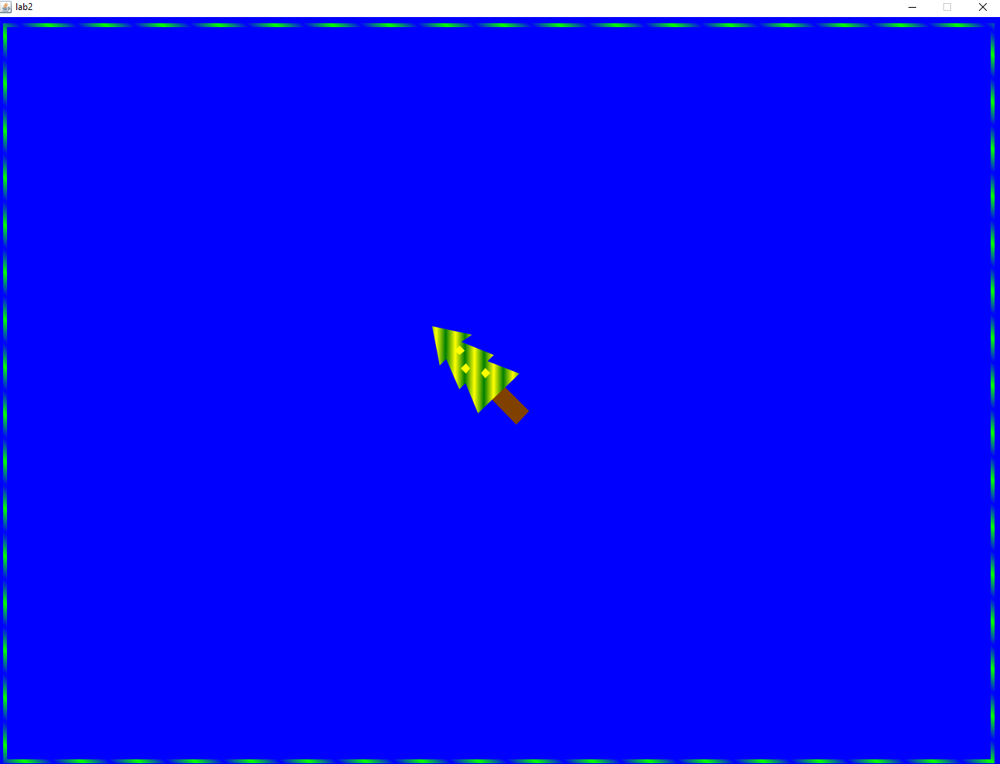
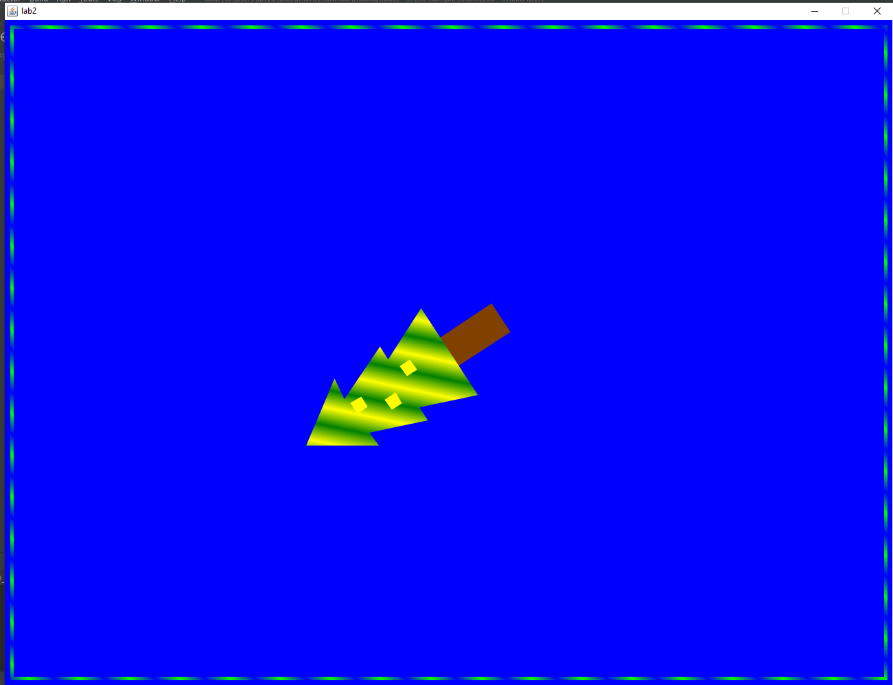
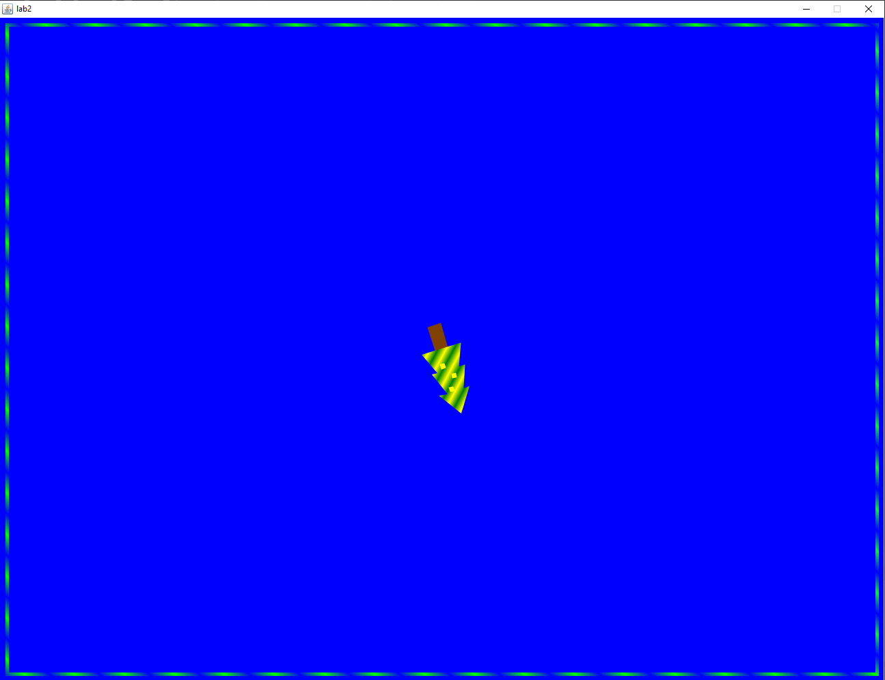
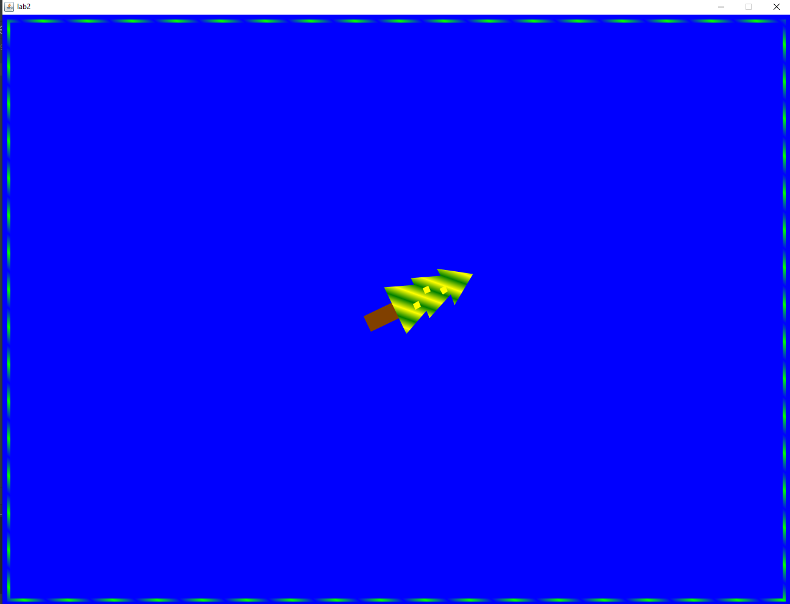

#Лабораторна робота №2: Побудова та анімація зображень за допомогою Java2D 

Варінт 20: JOIN_MITER, обертання навколо центру малюнка проти годинникової стрілки, маштабування

Скріншоти виконання:

 

 